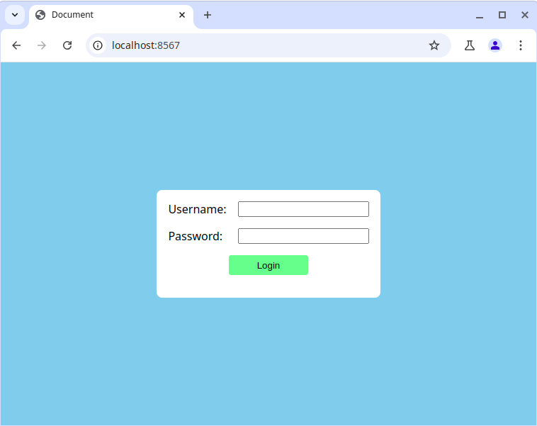
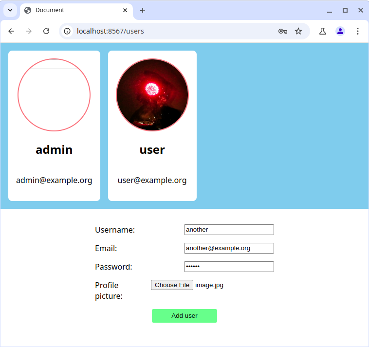

# Task 02

Your task is to create a full stack user registry website. The frontend design is not very important, but there are reference images below.

## Requirements

- If you are not logged in, the website displays a login page
- If you are logged in, the website displays a list of users
- If you are logged in, you can log out
- If you are logged in, you can delete existing users
- If you are logged in, you can also add a new user with a form

- The backend must have a REST API with the following endpoints:
  - `POST /api/login` - Log in with a username and password
  - `GET /api/users` - Get a list of all users
  - `POST /api/users` - Add a new user

- The frontend user adding form must ask for username, email, password and profile picture
- The frontend must be served using EJS templates by the backend

- The login system must use cookies for authentication
- User data must be stored in a JSON file
- User passwords must be hashed using bcrypt
- Because can be created only after login, the first user must be added manually

## Reference images

